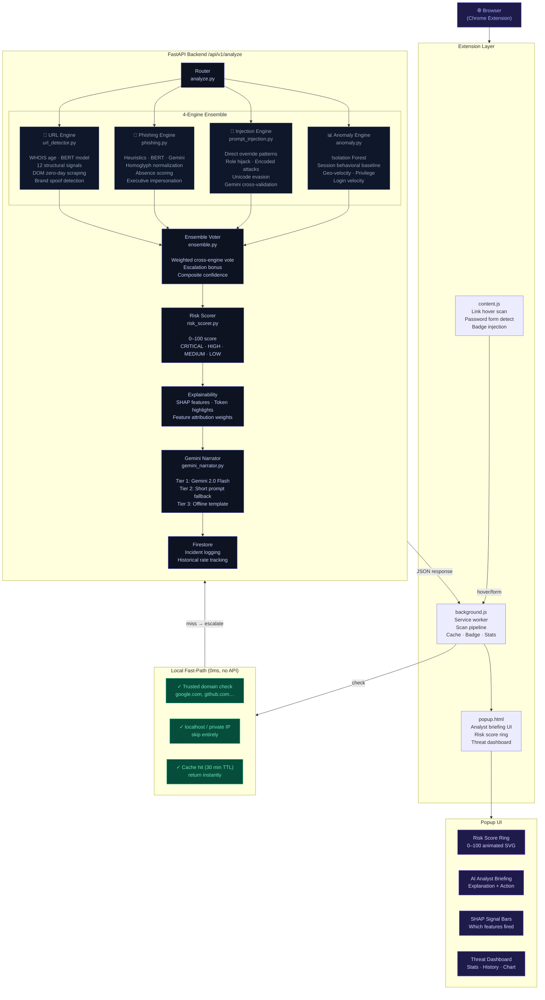

# SentinelIQ — System Architecture

> **"Explainable Real-Time Browser Threat Intelligence"**

---

## Full Architecture Diagram



---

## Data Flow — Single URL Scan

```
User visits page
      │
      ▼
content.js detects URL
      │
      ▼
background.js:
  ├─ Trusted domain?     → BENIGN (0ms, no API call)
  ├─ localhost?          → BENIGN (0ms)
  ├─ Cache hit (< 30m)?  → return cached result (0ms)
  └─ None of above       → call FastAPI
                                │
                         ┌──────┴──────┐
                         │  /analyze   │
                         └──────┬──────┘
                                │
                    ┌───────────┼───────────┐
                    ▼           ▼           ▼
               URL Engine   Phishing    Injection
              (WHOIS+BERT)  (BERT+Gem)  (patterns)
                    │           │           │
                    └───────────┼───────────┘
                                ▼
                         Ensemble Vote
                         Weighted confidence
                         Escalation bonus
                                │
                                ▼
                          Risk Score 0–100
                          SHAP features
                                │
                                ▼
                       Gemini Narration
                       Explanation + Action
                                │
                                ▼
                       JSON Response → Extension
                                │
                         ┌──────┴──────┐
                         │   Popup UI  │
                         │  Risk ring  │
                         │  Briefing   │
                         │  Signals    │
                         └─────────────┘
```

---

## Engine Weights (Ensemble Voter)

| Engine | Weight | Detects |
|---|---|---|
| Phishing | 0.30 | Email/text social engineering |
| Prompt Injection | 0.28 | AI chatbot manipulation attacks |
| URL | 0.25 | Malicious/phishing URLs |
| Anomaly | 0.17 | Behavioral session anomalies |

---

## Scanning Priority (Content Script)

| Priority | Trigger | Action |
|---|---|---|
| 0 — Skip | Trusted domain / localhost | No scan, instant BENIGN |
| 1 — Immediate | Page load (current URL) | Full backend scan |
| 1 — Immediate | Password form detected | Escalated scan + banner |
| 2 — On demand | Link hover (250ms debounce) | Scan + tooltip |
| 3 — Manual | Popup URL input | Scan on demand |

---

## Privacy Model

> **SentinelIQ performs lightweight local filtering before escalating suspicious URLs for deep analysis.**

| URL Type | What happens to it |
|---|---|
| Trusted domain (google.com etc.) | Never sent to backend — verdict locally |
| localhost / private IPs | Never sent — local fast-path |
| Cached result (< 30 min old) | Never re-sent — served from local cache |
| Ambiguous/suspicious URL | Sent to backend for deep analysis |

**No URL content is stored permanently.** Scan results are cached locally in Chrome storage with a 30-minute TTL. The backend logs only the incident verdict and metadata to Firestore — not the full URL query parameters.

---

## Competitive Differentiation

| Competitor | Gap | SentinelIQ Advantage |
|---|---|---|
| Chrome Safe Browsing | Blocklist only, no explanation | XAI: explains WHY flagged + analyst action |
| Avast / Bitdefender Extension | Can't detect LLM-generated phishing | Gemini Layer C validates AI-written attacks |
| VirusTotal | Manual submission, no inline | Zero-friction auto scan on every hover |
| GPT / ChatGPT | No browser integration, no WHOIS | Runs inline, live WHOIS, DOM scraping |
| Trend Micro | No prompt injection detection | 4th engine: AI chatbot attack shield |

---

## Zero-Day Detection Capability

SentinelIQ catches threats **before they appear on any blocklist**:

1. **WHOIS domain age** → Flags domains registered < 7 days ago
2. **DOM scraping** → Detects brand logo + password form on wrong domain
3. **Brand spoof rules** → `paypa1.com`, `micros0ft-login.xyz` structural detection
4. **Homoglyph normalization** → Catches Unicode lookalike attacks (`раypal.com`)

> **"We catch what Google Safe Browsing misses — on day zero."**
