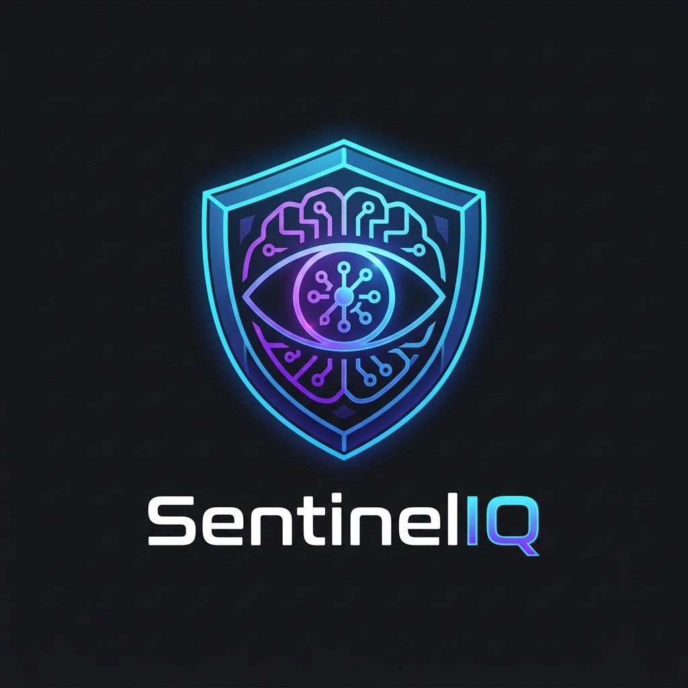
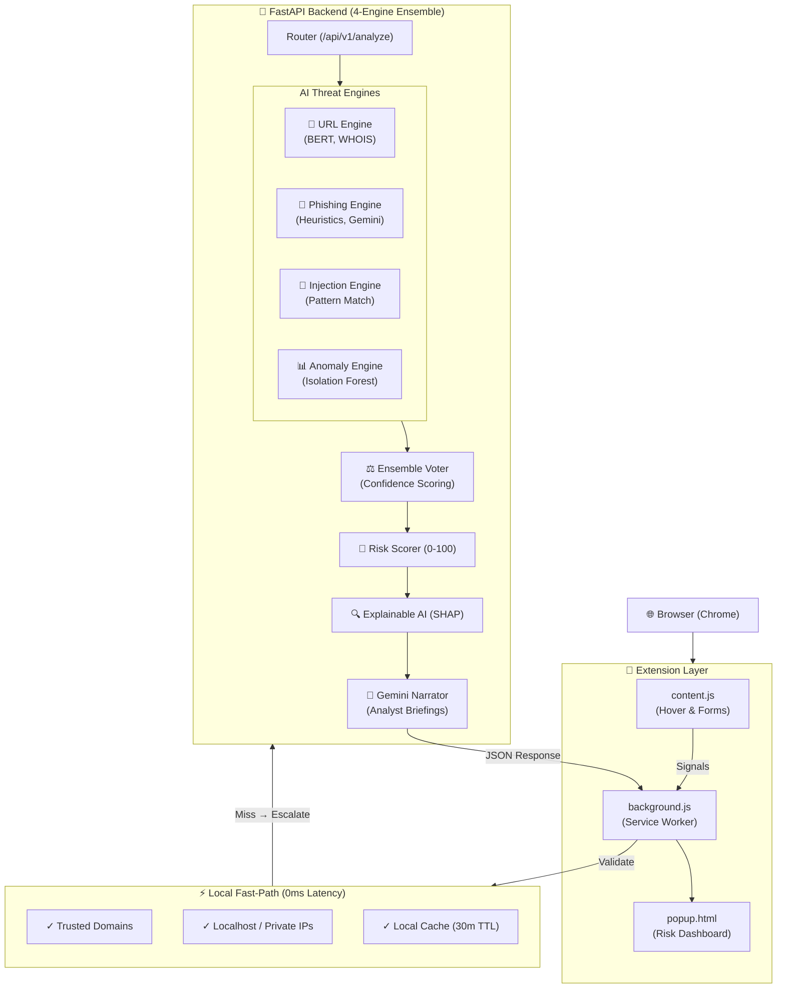

<div align="center">
  
  <h1>SentinelIQ</h1>
  <p><b>Explainable Real-Time Browser Threat Intelligence</b></p>
  
  [](https://www.python.org/)
  [](https://nodejs.org/)
  [](https://fastapi.tiangolo.com/)
  [](https://reactjs.org/)
  
  <p>
    An advanced, privacy-first threat detection ecosystem featuring a 4-engine ensemble, zero-day threat prevention, and real-time Explainable AI (XAI) insights.
  </p>
</div>

---

## 🌟 Product Overview

**SentinelIQ** is a zero-latency, highly optimized browser extension and backend ecosystem designed to intercept zero-day phishing, malicious URLs, prompt injections, and behavioral anomalies. Unlike traditional blocklists, SentinelIQ leverages a robust 4-Engine Ensemble and state-of-the-art XAI to not just block threats, but **explain why** they were flagged, offering unparalleled transparency and actionable intelligence.

### 🛡️ Core Capabilities

- **Zero-Day Detection**: Catches threats before they appear on blocklists using WHOIS domain age, DOM scraping, and brand spoof rules.
- **4-Engine Ensemble Architecture**: Combines Phishing, URL, Prompt Injection, and Anomaly engines for high-confidence verdicts.
- **Explainable AI (XAI)**: Demystifies AI decisions with SHAP feature attributions and Token highlights.
- **Privacy-First Fast Path**: Local trusted domain checks and caching ensure complete privacy for non-malicious browsing.

---

## 🏗️ System Architecture

Our highly optimized pipeline operates on a lightweight local filtering model before escalating suspicious URLs for deep analysis, guaranteeing zero latency for safe domains.



---

## 🚀 Quick Start & Setup Guide

### 1. Prerequisites
- **Python 3.11** (Required for the AI backend ecosystem)
- **Node.js 18+** (Required for the frontend dashboard and extension builds)
- **Git**

### 2. Backend Setup (Run Once)

Initialize the virtual environment and install the required machine learning and server dependencies:

```bash
cd sentineliq/backend
python -m venv venv

# Windows
venv\Scripts\activate
# Mac/Linux
source venv/bin/activate

pip install -r requirements.txt
cp .env.example .env
```

**Obtain a Free Gemini API Key (Highly Recommended)**
1. Visit [Google AI Studio](https://aistudio.google.com/)
2. Click **Get API Key** and copy it.
3. Paste it into your `backend/.env` file: `GEMINI_API_KEY=your_key_here`

*(Note: The system gracefully degrades to heuristics and templates if the Gemini key is omitted.)*

### 3. Running the Ecosystem

You will need two separate terminal windows for the backend and frontend.

**Terminal 1: Start the Backend (FastAPI)**
```bash
cd sentineliq/backend
venv\Scripts\activate      # Windows
# source venv/bin/activate # Mac/Linux
uvicorn main:app --reload --host 0.0.0.0 --port 8000
```
*API Documentation available at: [http://localhost:8000/docs](http://localhost:8000/docs)*

**Terminal 2: Start the Frontend (Vite/React)**
```bash
cd sentineliq/frontend
npm install
npm run dev
```
*Dashboard available at: [http://localhost:5173](http://localhost:5173)*

---

## ⚙️ Environment Variables Reference

| Variable | Required | Description |
|---|:---:|---|
| `GEMINI_API_KEY` | ❌ | Enables AI narration and advanced heuristic validation. |
| `FIREBASE_SERVICE_ACCOUNT` | ❌ | Path to Firebase JSON for remote logging (app works 100% locally without it). |
| `MODEL_CACHE_DIR` | ❌ | Directory for HuggingFace model downloads. Default: `./model_cache` |
| `ENVIRONMENT` | ❌ | `development` or `production` |

---

## 🔌 API Reference Highlights

The FastAPI backend exposes a robust suite of REST endpoints, built for low-latency integrations.

| Endpoint | Method | Purpose |
|---|---|---|
| `/health` | `GET` | System health check and model status verification. |
| `/api/v1/analyze` | `POST` | Primary analysis endpoint. Evaluates content against the 4-Engine Ensemble. |
| `/api/v1/incidents` | `GET` | Fetch historical security incidents. |
| `/docs` | `GET` | Explore the interactive OpenAPI (Swagger) interface. |

### `/api/v1/analyze` Request Schema (Form Data)

| Field | Type | Required | Description |
|---|---|:---:|---|
| `threat_type` | string | ✅ | Target engine: `phishing`, `url`, `prompt_injection`, or `anomaly`. |
| `content` | string | ✅* | The text, URL, or raw content to analyze. *(Optional if `file` is provided)* |
| `file` | file | ❌ | Direct file upload (PDF, TXT, EML, JSON, CSV). |

---

## 🔍 Chrome Web Store Reviewers Note

**Regarding `host_permissions` for localhost/127.0.0.1:**
SentinelIQ allows privacy-conscious enterprise users to self-host the FastAPI threat detection backend locally. The `http://127.0.0.1:8000/*` and `http://localhost:8000/*` permissions are explicitly requested to allow the extension to communicate with this user-hosted backend without triggering cross-origin network errors. The default configuration points to our secure production endpoint, and localhost is only accessed if the user manually configures it in the extension's Settings panel.

### Testing HTML Smuggling (Local Files)
If you are evaluating SentinelIQ against downloaded malicious `.html` files (HTML smuggling), **Chrome disables file access for extensions by default**. To enable this zero-day defense:
1. Navigate to `chrome://extensions/`
2. Click **Details** on the SentinelIQ extension.
3. Toggle **Allow access to file URLs** to **ON**.
Without this permission, Chrome physically blocks `content.js` from reading the DOM of local files, preventing SentinelIQ from scanning the payload.

---

<div align="center">
  <sub>Built with 🔒 by the SentinelIQ Security Team.</sub>
</div>
